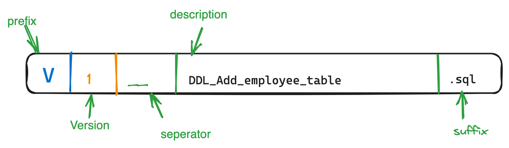
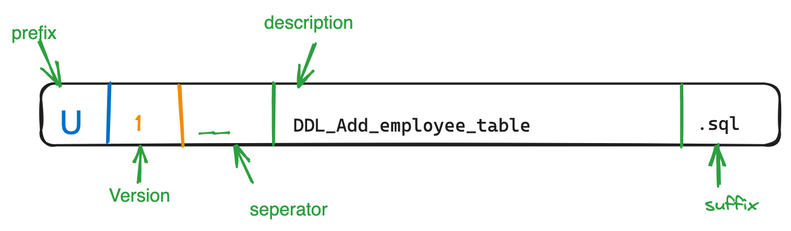
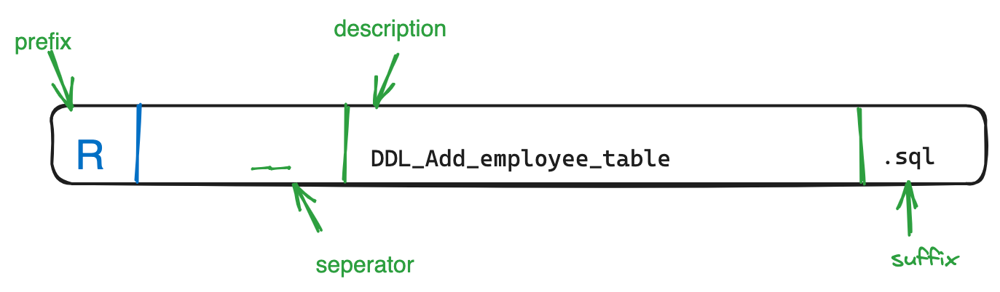

# Spring Testing Framework

## Unit test class support by Spring TestingFramework
Spring Testing Framework provides few helpful mocked class(General Purpose Test Util class) that can be used in unit testing.
* MockEnvironment
  * If a class has dependency to `Environment` then `MockEnvironment` class can easily be used in Unit testing. `MockEnvironment` class's set method can be used to set the property.
  * See `DbConfigTest` for example.
* `ReflectionTestUtils` can be used to set non public field of object, set the dependency as well.
  *  See `DbConfigTestUsingReflectionTestUtils`

Apart from General Purpose Test Util classes Spring provides MVC related general purpose Test util classes. We will see that in while.

## Spring Test Context Initialization

* Using Component Classes Refer: `DatasourceProviderTestContextLoadWithClass`
* Using `TestPropertySource`
  TestPropertySource can be configured by following ways:
  - Inline, Key and values pair can be passed inline like below 
    ```java 
    @TestPropertySource(properties = {"db.username=childUsername", "db.password=childPassword"}) 
    ```
  -  From property file like below 
     ```java
            @TestPropertySource(locations="");
      ``` 
  * File Resolution
    - When nothing is passed, directory => Test file location and file name => Test file name
    - It can look for file from classpath directory. Like this `classpath: db.properties`
    - It can look for file from other location as well like this `file: ~/db.properties`
* Using `Profile`
    Create a configuration class annotate that with `@Profile` and then to use it in Testing just annotate test file with `@ActiveProfile`
    Whenever Active Profile changes, Spring reloads the context with respective configuration specified in Profile. For Example, If a Test class
    having ActiveProfile for dev then Test loads dev configuration and run the test. If a there is Nested test inside the same test class, then
    previously loaded configuration gets unloaded and Spring adds new profile related configuration.

   `@NestedTestConfiguration` accepts argument either inherit(default) or override mode. Override mode clears all configuration
    coming from outer test class. Nested test class having`@NestedTestConfiguration` with override mode must specify new configuration
    with which Test will run. If no configuration is passed then this is like running test without any spring context initialized.

  Refer `LoadConfigWithProfileTest` to see example
* Using `contextInitializer` 
    Refer `DataSourceProviderWithContextInitializer`
* Using Inheritance:
  * Test class inherit context configuration from Super or Nested class's configuration. However, if TestClass contains some bean or property
   with the same name then bean or property coming from super class gets overridden by current Test class configuration.
   ```java
            @SpringJunitConfig(inheritLocations = false) // Don't inherit configuration either through property sources or component class
  ```
    ```java
          @SpringJunitConig(inheritInitializers = false) // does the same thing but apply only for ContextInitializer classes
     ```


# Flyway:
<p>
Flyway can be configured in Spring boot app with two ways: 1) auto configuration 2) Manual configuration using Flyway API.
AutoConfiguration is the one that gets used  most of time.However, in situation like where multiple datasources are available, Manual configuration is needed.
</p>

### Auto Configuration:
 Just need to add few properties to `application.properties`
 ```
 spring.flyway.enabled=true
spring.flyway.baseline-on-migrate=true
spring.flyway.locations=classpath:db/migration
 ```
### Manual Configuration:
 - Step 1: Get Flyway instance
 - Step 2: call migrate on flyway instance
 ```java
         final Flyway flyway = Flyway.configure().dataSource(dataSource)
                .locations(GLOBAL_MIGRATION_SCRIPTS_PATH)
                .baselineOnMigrate(true)
                .outOfOrder(false)
                .load();
        flyway.repair();
        return flyway;
   ```
 When there are multiple datasource

### File Naming Convention:

-  For Version migration file : 
-  For Undo migration file:

- For Repeatable migration file:
- 

# TestContainers

 ### Required dependencies:

Common apart from Junit-jupitor. one for test-container and other is for integration with Jupitor
```groovy
testImplementation "org.testcontainers:testcontainers:1.19.1"
testImplementation "org.testcontainers:junit-jupiter:1.19.1"
```
Apart from this, TestContainer needs container specific module. Test container has different module for different type of container.
For example: MSSql module, mysql module,oracleDb module etc.Currently, we are adding MSSql related module because we want MSSQL container.
 ```groovy
testImplementation 'org.testcontainers:mssqlserver'
 ```

### Usage:
 Two primary annotation is needed `@Testcontainers` at class level and `@Container`
 @TestContainers hints Junit-Jupitor to looks for all variable having `@Container` and manage(create and destroy)them.

```If Variables not static then for each test containers gets created and destroyed```

```java
@Testcontainers
public class AuthorControllerIT {

    @Container
    MSSQLServerContainer mssqlServerContainer = new MSSQLServerContainer("mcr.microsoft.com/mssql/server:2022-latest")
            .acceptLicense();

    @Test
    void test1() {
        System.out.println(mssqlServerContainer.getJdbcUrl());
    }
    
    @Test
    void test2() {
        System.out.println(mssqlServerContainer.getJdbcUrl());
    }
}

```

In the above example ```mssqlServerContainer``` is not static. Hence, two different container gets created and destroyed for test1 and test2 which is not ideal for common scenario.
Ideally, we would like to have one container gets created before any tests within a test suite(TestClass) and use the same container for all test cases. This will reduce
overall test execution runtime because container creation take time.

Testcontainers has given a solution for this. Just mark the variable as ```static```. This way same container gets used for all tests within a test file.

```java
@Container
static MSSQLServerContainer mssqlServerContainer = new MSSQLServerContainer("mcr.microsoft.com/mssql/server:2022-latest")
            .acceptLicense();
```


